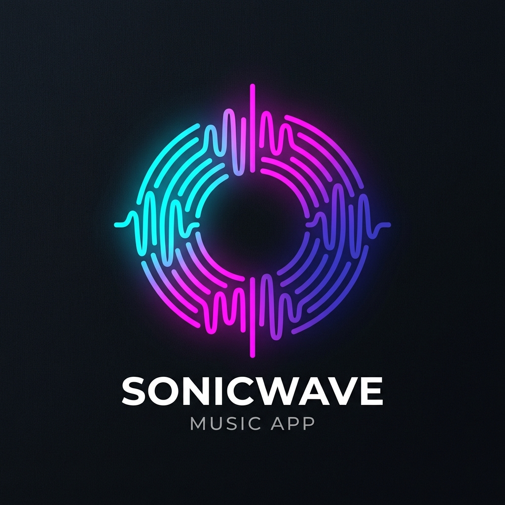

# 🎵 Sonicwave - Next-Gen Music Streaming Platform

<div align="center">



**A high-performance, modern music streaming web application with 41+ top Indian, Marathi, and Global Pop artists, 180+ verified high-fidelity songs, responsive design, and zero autoplay on startup.**

[](LICENSE)
[](https://developer.mozilla.org/en-US/docs/Web/HTML)
[](https://developer.mozilla.org/en-US/docs/Web/CSS)
[](https://developer.mozilla.org/en-US/docs/Web/JavaScript)
[](manifest.json)
[](https://vercel.com/new)
[](https://app.netlify.com/start)

</div>

---

## 🌟 Key Features

- 🎧 **41+ World-Class Superstar Artists**:
  - **Marathi Superstars**: Ajay-Atul, Swapnil Bandodkar, Avdhoot Gupte, Bela Shende, Adarsh Shinde, Mahesh Kale.
  - **English & Global Pop**: Taylor Swift, The Weeknd, Ed Sheeran, Billie Eilish, Dua Lipa, Justin Bieber, Coldplay.
  - **Indian Icons & Legends**: Arijit Singh, Shreya Ghoshal, AR Rahman, Kishore Kumar, Lata Mangeshkar, Sonu Nigam, KK, Mohit Chauhan.
  - **Punjabi Powerhouses**: Karan Aujla, Diljit Dosanjh, Shubh, AP Dhillon, Sidhu Moose Wala, Badshah, B Praak.
  - **Indie & Acoustic Sensations**: Anuv Jain, Prateek Kuhad, King, Jasleen Royal, Divine.
  - **South Cinema**: Anirudh Ravichander, Sid Sriram.
- 🎶 **180+ Verified High-Fidelity Tracks**: Every song includes verified streaming IDs and authentic high-resolution album cover artwork.
- 🔇 **Zero Autoplay on Startup**: Opens gracefully in a paused state with full player controls, waiting for your click.
- 🔍 **Universal Search Engine**: Search millions of songs across iTunes and YouTube with instant live playback.
- 📱 **Full Device Compatibility & PWA**: Seamless responsive layout for Mobile, Tablet, PC, and Mac, with Progressive Web App (PWA) offline caching and native app installation support.
- 👤 **Role-Based Auth & Admin Management**: Built-in User and Admin roles (`Admin` can access the Admin Dashboard to manage users, tracks, and database).
- 🎛️ **Full Player Engine**: Play/Pause, Seek bar, Volume slider, Next/Prev track, Shuffle, Repeat (All / One), Liked songs, and custom playlist creation.

---

## 🚀 Deployment Guide (Ready to Publish)

### 1. Deploy on Vercel (Recommended - 100% Free & Fast)
1. Push this repository to **GitHub**.
2. Go to [Vercel](https://vercel.com/) and click **"Add New Project"**.
3. Select your GitHub repository.
4. Keep the default settings (Vercel automatically detects `vercel.json` and `api/resolve.js`).
5. Click **"Deploy"**! Your website is live worldwide with HTTPS.

---

### 2. Deploy on Netlify
1. Push this repository to **GitHub**.
2. Go to [Netlify](https://app.netlify.com/) and click **"Add new site"** -> **"Import an existing project"**.
3. Select your repository.
4. Set publish directory to `.` (root).
5. Click **"Deploy Site"**!

---

### 3. Deploy on GitHub Pages
1. Go to your repository on GitHub.
2. Navigate to **Settings** > **Pages**.
3. Under **Build and deployment** > **Source**, choose `Deploy from a branch`.
4. Select `main` branch and `/ (root)` folder, then click **Save**.
5. Your app will be live at `https://<username>.github.io/<repository-name>/`.

---

### 4. Deploy with Docker (Render / Railway / DigitalOcean / AWS)
```bash
# Build Docker image
docker build -t sonicwave-app .

# Run Docker container
docker run -d -p 8080:8080 --name sonicwave sonicwave-app
```
Or using Docker Compose:
```bash
docker-compose up -d
```

---

## 💻 Local Development

1. **Clone the repository:**
   ```bash
   git clone https://github.com/your-username/sonicwave-streaming.git
   cd sonicwave-streaming
   ```

2. **Start the local server:**
   ```bash
   python server.py
   ```
   *Or if using Node.js:*
   ```bash
   npx serve .
   ```

3. **Open in browser:**
   ```
   http://localhost:8080/
   ```

---

## 📂 Project Architecture

```text
├── index.html              # Main HTML5 application structure with SEO & PWA headers
├── style.css               # Vanilla CSS design system (dark glassmorphism, responsive grids)
├── app.js                  # Core application engine, YouTube player bridge, 41+ artists data
├── server.py               # Lightweight Python HTTP server & YouTube resolver
├── manifest.json           # PWA Web App Manifest for mobile/desktop app install
├── sw.js                   # Service worker for offline caching and fast asset delivery
├── vercel.json             # Vercel deployment configuration
├── netlify.toml            # Netlify deployment configuration
├── api/
│   └── resolve.js          # Vercel Serverless Function for YouTube audio search
├── logo.png                # App icon & OpenGraph preview image
├── logo.jpg                # High-res branding asset
├── package.json            # Node.js package scripts
├── Dockerfile              # Docker container configuration
├── docker-compose.yml      # Docker compose stack
└── README.md               # Project documentation & deployment guide
```

---

## ⌨️ Keyboard Shortcuts

| Shortcut | Action |
| :--- | :--- |
| <kbd>Space</kbd> | Play / Pause Toggle |
| <kbd>Shift</kbd> + <kbd>→</kbd> | Next Track |
| <kbd>Shift</kbd> + <kbd>←</kbd> | Previous Track |
| <kbd>M</kbd> | Mute / Unmute Volume |
| <kbd>L</kbd> | Save to Liked Songs |

---

## 🔐 Default Demo Accounts

| Role | Username / Email | Password |
| :--- | :--- | :--- |
| **Admin** | `Sai Patil` / `sai@sonicwave.com` | `admin` |
| **Admin** | `admin` / `admin@sonicwave.com` | `admin123` |
| **User** | `Rahul Sharma` / `rahul@example.com` | `user123` |

---

## 📄 License
This project is open-source and licensed under the **MIT License**.
